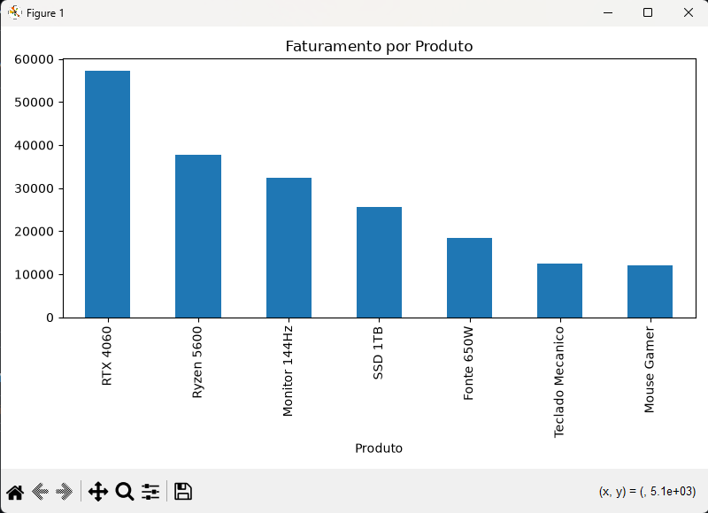
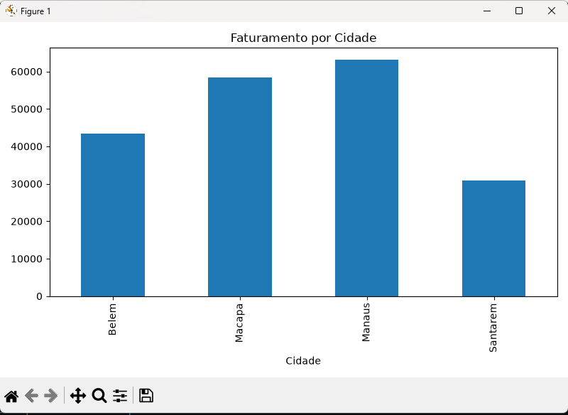

# 📊 Análise de Vendas de Produtos de Informática

## 📌 Sobre o Projeto

Este projeto foi desenvolvido com o objetivo de praticar conceitos de Análise de Dados utilizando Python, Pandas e Matplotlib.

A análise foi realizada a partir de uma base de dados simulada contendo vendas de produtos de informática em diferentes cidades e meses do ano. O foco foi transformar dados brutos em informações úteis para apoiar a tomada de decisão.

---

## 🎯 Objetivos

* Calcular o faturamento total das vendas.
* Identificar os produtos com maior faturamento.
* Comparar o desempenho das cidades.
* Avaliar o faturamento por categoria.
* Criar visualizações gráficas para facilitar a análise.

---

## 🛠️ Tecnologias Utilizadas

* Python
* Pandas
* Matplotlib
* CSV (Base de Dados)

---

## 📂 Estrutura do Projeto

```text
analise-vendas-ti/
│
├── vendas.csv
├── analise_vendas.py
├── README.md
├── graficos_produto.png
└── graficos_cidade.png
```

---

## 📈 Análises Realizadas

### Faturamento por Produto

Identificação dos produtos que mais contribuíram para o faturamento da empresa.

### Faturamento por Cidade

Comparação do desempenho de vendas entre diferentes cidades.

### Faturamento por Categoria

Análise do desempenho das categorias de produtos.

### Faturamento Total

Cálculo do valor total gerado pelas vendas da base de dados.

---

## 🚀 Como Executar

### 1. Instalar as dependências

```bash
py -m pip install pandas matplotlib
```

### 2. Executar o projeto

```bash
python analise_vendas.py
```

---

## 📊 Exemplos de Visualizações

Após a execução do script, são gerados gráficos de faturamento por produto e por cidade para facilitar a interpretação dos resultados.

---

## 💡 Principais Aprendizados

Durante o desenvolvimento deste projeto foram aplicados conceitos de:

* Manipulação de dados com Pandas
* Agrupamento e agregação de informações
* Criação de métricas de negócio
* Visualização de dados com Matplotlib
* Estruturação de projetos para portfólio

---

## 👨‍💻 Autor

Marcus Vinicius Almeida


## 📊 Gráficos Gerados

### Faturamento por Produto



### Faturamento por Cidade


